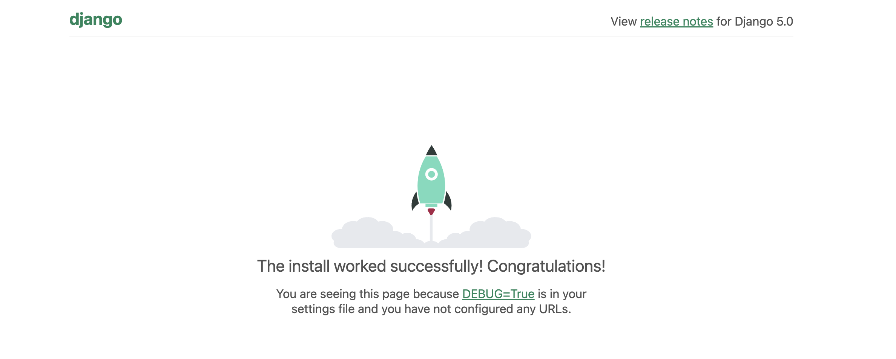

# learn-django
Repositorio para aprender Django

# Instalación de Django

1. Crear entorno virtual y activarlo
2. Instalar Django: 
```
python -m pip install Django
```
3. Ver versión de Django:
```
python3 -m django --version
```
4. Crear proyecto:
```
django-admin startproject <nombre_de_tu_app> .
```
5. Deberías ver una carpeta con el nombre `<nombre_de_tu_app>`

## Comandos

Crear venv:
```
    python3 -m virtualenv venv
```
Activar venv en Mac/Linux:
```
    source venv/bin/activate
```
Activar venv en Windows:
```
    venv\Scripts\activate
```
Desactivar venv:
```
    deactivate
``` 
Instalar Django:
```
    pip install django
```

## PM2 

1. Copiar el archivo `pm2.json` a vuestro proyecto
2. Cambiar datos como `nombre de app`, `puerto`, etc.
3. Iniciar proceso:
```
    pm2 start pm2.json
```
4. Para mirar log:
```
    pm2 ls
```
y usando el id de la izquierda:
```
    pm2 log <id>
```
=======
## Django

Es uno de los frameworks más populares de Python que sirve para backend y web apps completas. 

- El framework facilita la gestión de base de datos mediantes modelos. Django tiene un ORM (permite conectar a db con Python).
- Hay gestor de rutas para crear URLs
- Puedes gestionar recursos o logica mediante funciones o clases
- Te asegura unos mínimos estándares de calidad como: seguridad, velocidad, etc.
- Trae un **panel de administración** ya creado por defecto que podemos usar enseguida con nuestros modelos.
  - Hay un login, logout ya disponibles.

Django funciona con la estructura MVT:

- Model (`models.py`): modelos (clases) para tablas en base de datos
- View (`views.py`): vistas (funciones o métodos de clases) que se llaman cuando corresponde y aplican la lógica necesaria
- Template (`templates/`): HTML que se va a devolver como respuesta. Se puede aplicar lógia de Python
- Urls (`urls.py`): rutas habilitadas donde se pueden hacer peticiones


## W3Schools

- Tutorial: https://www.w3schools.com/django/index.php


## Pasos para crear un proyecto: 

1. Crear entorno virtual: `python -m venv .venv` # nombres habituales son `venv` o `.venv`
  - Para actualizar y que no salga warning con pip: `pip install --upgrade pip`
    - Comprobamos versiones: `python --version` y `pip --version`
  - Activar venv: `source .venv/bin/activate`, Windows: `.\<venv>\Scripts\activate`
    - Comprobar ubicación del venv: `which python`
  - Desactivar: `deactivate`
2. Instalación de Django en venv:
  - `pip list` -> debe mostrar pocas librerías
  - Con el venv activado: `pip install Django`
  - `pip list` -> debe aparecer `Django`
    - info de Django: `pip show Django`
  - Para ver la versión del gestor de Django: `django-admin --version`
3. Creación de Proyecto
  - Ejecutamos: `django-admin startproject my_tennis_club` -> debe aparecer una carpeta `my_tennis_club` (adecuado para varios proyectos)
    - Variante: `django-admin startproject my_tennis_club .` (<- punto final) adecuado cuando es el único proyecto // no hace la doble carpeta my_tennis_club
  - Renombro la carpeta de fuera como `proyecto`

  **Ejecutamos el proyecto**
  - Navegar en consola hasta donde tenéis `manage.py`
  - `python manage.py runserver` -> http://127.0.0.1:8000/
  
  

## Django docs

Hay 8 tutoriales para hacer en: https://docs.djangoproject.com/en/5.0/intro/tutorial01/

## DRF

https://www.django-rest-framework.org/
